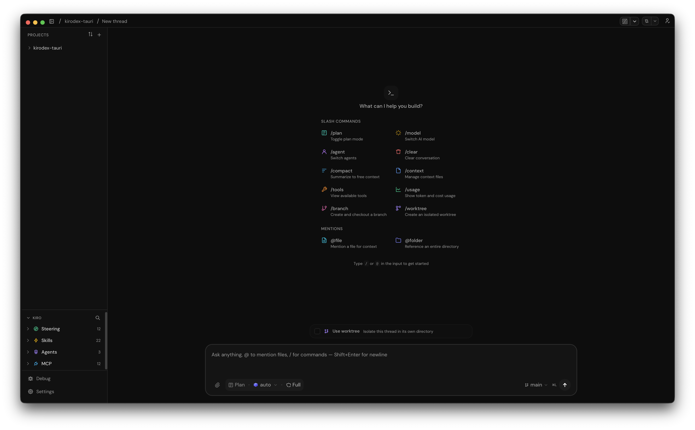
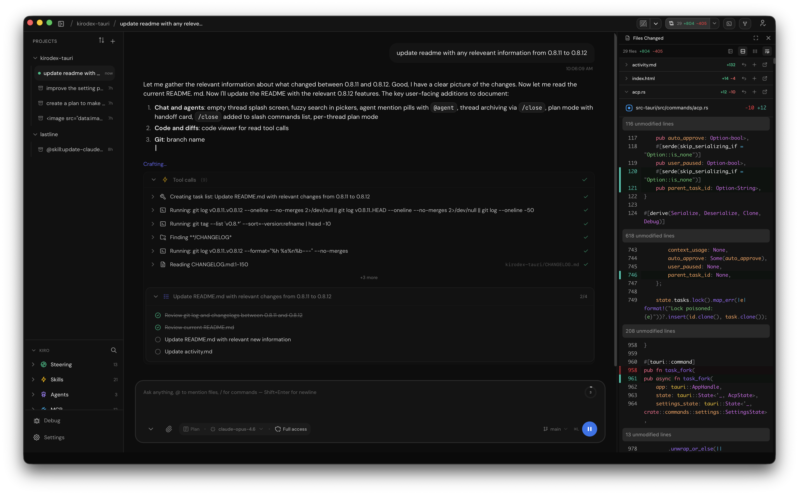

<p align="center">
  <a href="https://github.com/thabti/kirodex">
    
  </a>
  <h1 align="center">Kirodex</h1>
  <p align="center">
    AI coding agents on your desktop — 12MB, ~0% CPU at idle
    <br />
    Inspired by <a href="https://github.com/openai/codex">OpenAI Codex</a> and <a href="https://github.com/pingdotgg/t3code">T3 Code</a>
    <br />
    <br />
    <a href="https://thabti.github.io/kirodex/">Website</a>
    ·
    <a href="https://github.com/thabti/kirodex/releases/latest">Download</a>
    ·
    <a href="https://github.com/thabti/kirodex/issues">Report Bug</a>
    ·
    <a href="https://github.com/thabti/kirodex/issues">Request Feature</a>
  </p>
  </p>
  <table>
    <tr>
      <td></td>
      <td></td>
    </tr>
  </table>


<div align="center">

[](LICENSE)
[](https://rustup.rs)
[]()

`12 MB app` · `~0% CPU at idle` · `~110 MB RAM` · `Native Rust · No Electron`

</div>

---

## Install

<div align="center">

<a href="https://github.com/thabti/kirodex/releases/latest">
  🍎 macOS (Apple Silicon) .dmg
</a>
<br />
<a href="https://github.com/thabti/kirodex/releases/latest">
  🐧 Linux x64 .deb / .AppImage
</a>
<br />
<a href="https://github.com/thabti/kirodex/releases/latest">
  🪟 Windows x64 .exe / .msi
</a>

<br />
<br />

</div>

### Package managers

**macOS (Homebrew):**

```bash
brew install --cask thabti/tap/kirodex        # first install
brew update && brew reinstall kirodex          # upgrade
```

**Linux:**

```bash
# Debian / Ubuntu — download from releases
sudo dpkg -i kirodex_*_amd64.deb

# AppImage — download and run
chmod +x Kirodex_*.AppImage && ./Kirodex_*.AppImage
```

**Windows:**

```powershell
# Download the .exe installer or .msi from releases
# winget and scoop support coming soon
```

> Requires [kiro-cli](https://kiro.dev) installed and in your PATH. Without it, Kirodex will launch but every agent action fails with "Failed to spawn kiro-cli" — see [Troubleshooting](#troubleshooting).

---

## Features

**Chat and agents**
- Chat interface via the [Agent Client Protocol](https://github.com/anthropics/agent-client-protocol) SDK
- Threaded agentic development — each conversation runs as an independent agent thread with its own context, tool calls, and execution history
- Empty thread splash screen with clickable slash commands and `@` mentions to get started fast
- Slash commands (`/clear`, `/close`, `/model`, `/agent`, `/plan`, `/chat`, `/data`, `/branch`, `/worktree`, `/fork`) with fuzzy search across all pickers
- Agent mention pills (`@agent`) with built-in agents, styled icons, and fuzzy matching
- Plan mode with per-thread state and a handoff card to start building after planning
- Context-aware plan handoff — when context usage grows past 30% in plan mode, a suggestion banner appears to switch to implement mode before the context window fills up; the plan is preserved across compaction so the coding agent picks up where the planner left off
- Thread archiving — `/close` preserves conversation history in a read-only view instead of deleting
- Task management: create, pause, resume, cancel, delete
- Question cards — agents can ask multi-choice questions; pick an option and reply inline
- Subagent display — parallel agent pipelines render as expandable stage cards with dependency indicators
- Kiro config sidebar — browse agents (grouped by stack), skills, steering rules, and MCP servers from `.kiro/`
- Emoji and project-file icon picker for customizing thread icons

**Code and diffs**
- Syntax-highlighted inline and side-by-side diff views ([Shiki](https://shiki.style))
- `strReplace` tool calls rendered as git-style diffs inline in chat
- Code viewer for read tool calls with line numbers and syntax highlighting
- Click a file operation in chat to jump to that file
- Changed files summary with per-file +/- stats and one-click stage/revert
- Image attachments sent as proper ACP `ContentBlock::Image` for multimodal agents

**Git**
- Branch, stage, commit, push, pull, fetch through [git2](https://crates.io/crates/git2) with SSH + HTTPS credential support (no shell commands)
- AI-powered commit message generation from diff stats
- Live diff stats in the header bar, always visible when a project is open
- Staged file count indicator in the diff toolbar
- Delete local branches from the branch selector
- Git worktree support — isolate each thread in its own working directory under `.kiro/worktrees/`
- `/branch` command to create and checkout a new branch inline
- `/worktree` command to create a worktree and spawn a new thread in it
- "Use worktree" checkbox on new thread page with auto-generated slug from your message
- Symlink heavy directories (e.g. `node_modules`) and copy gitignored files via `.worktreeinclude`
- Auto-cleanup worktree on thread close; prompts if uncommitted changes exist
- Sidebar badge and branch selector indicator for worktree-backed threads

**Analytics**
- Built-in analytics dashboard (`/data` or `/usage`) tracking coding hours, messages, tokens, tool calls, diff stats, model popularity, mode usage, slash command frequency, and project stats
- Nine chart types powered by [Recharts](https://recharts.org) with a [redb](https://crates.io/crates/redb) backend for ACID-compliant local persistence
- Clear data button in Settings > Advanced

**Notifications**
- Native desktop notifications when the agent finishes a turn while the app is in the background
- Configurable — toggle on/off in Settings > General > Permissions

**Terminal and settings**
- Integrated PTY terminal powered by [Ghostty](https://ghostty.org) WASM
- `Cmd+L` shortcut to focus the chat input from anywhere
- Open in editor — launch files in VS Code, Cursor, Zed, or your preferred terminal emulator
- Update checker with sidebar badge when a new version is available
- Quit confirmation dialog on `Cmd+Q` / window close
- Thread and state persistence across version updates with automatic backups
- Full-screen settings panel: CLI path, default model, auto-approve, font size, keyboard shortcuts, git integration, notification preferences, and analytics
- First-run onboarding wizard for CLI setup and authentication

---

## Development

### Prerequisites

- macOS, Linux, or Windows
- [Rust](https://rustup.rs) >= 1.78
- [Bun](https://bun.sh) >= 1.0 (or Node >= 20)
- [Tauri CLI](https://v2.tauri.app/start/create-project/#cargo): `cargo install tauri-cli --locked --version "^2.0.0"`
- [kiro-cli](https://kiro.dev) installed and in your PATH — required at runtime; `bun run dev` will open without it but agent actions fail

### Clone and run

```bash
git clone https://github.com/thabti/kirodex.git
cd kirodex
cargo install tauri-cli --locked --version "^2.0.0"   # if not already installed
bun install
bun run dev
```

This starts Vite on `localhost:5174`, compiles the Rust backend, and opens the Kirodex window.
The first build compiles ~430 crates and takes a few minutes. Subsequent builds are incremental (~2s).

### Commands

| Command | What it does |
|---------|-------------|
| `bun run dev` | Start dev mode (Vite + Tauri) |
| `bun run build` | Production build (.app / .dmg / .exe / .deb) |
| `bun run check:ts` | TypeScript type check |
| `bun run check:rust` | Rust type check (`cargo check`) |
| `bun run test` | Run all tests (frontend + Rust) |
| `bun run bump:patch` | Bump version (patch) across all files |
| `bun run clean` | Remove build artifacts |

### kiro-cli detection

The app auto-detects kiro-cli at these paths (in order):

1. `~/.local/bin/kiro-cli`
2. `/usr/local/bin/kiro-cli`
3. `~/.kiro/bin/kiro-cli`
4. `/opt/homebrew/bin/kiro-cli`
5. Falls back to `which kiro-cli`

---

## Architecture

See [docs/architecture.md](docs/architecture.md) for the system diagram, backend module reference, and full tech stack.

## Troubleshooting

| Problem | Fix |
|---------|-----|
| `no such command: tauri` | Run `cargo install tauri-cli` to install the Tauri CLI. |
| "Failed to spawn kiro-cli" | Check kiro-cli is installed. Run `kiro-cli --version`. |
| Rust compilation errors | Run `rustup update`. Requires Rust >= 1.78. |
| Frontend type errors | Run `bun install`, then `bun run check:ts`. |
| First build is slow | Normal. Initial `cargo build` compiles ~430 crates. |
| macOS DMG won't open | Unsigned build — run `xattr -cr /path/to/Kirodex.app`. |

## Feature requests (PRs welcomed)

| Feature | Description |
|---------|-------------|
| Agent library | Browse and install agents from a curated registry |
| Skills library | Browse and install skills from a curated registry |
| Winget / Scoop | Windows package manager support |
| MCP server management | Add, remove, and configure MCP servers from the UI |

## Contributing

See [CONTRIBUTING.md](CONTRIBUTING.md) for guidelines, code style, release process, and project layout.

## Author

Sabeur Thabti

## Sponsor

[Lastline.app](https://lastline.app)

## License

MIT
