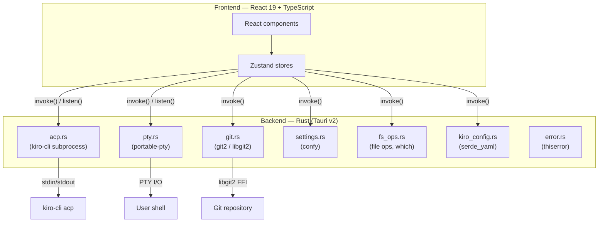

# Architecture

## System overview

Kirodex is a native macOS desktop app for managing AI coding agents via the Agent Client Protocol (ACP). The app is built with Tauri v2: a Rust backend handles subprocess management, git operations, file system access, terminal emulation, and config persistence, while a React 19 frontend provides the UI. All communication between the two layers happens through Tauri's IPC (`invoke()` for commands, `listen()` for events). There are no Node.js APIs in the frontend.

## Data flow

A typical user interaction follows this path: the React UI dispatches an action to a Zustand store, which calls a Tauri `invoke()` command. The Rust backend processes the command and, for streaming operations like ACP chat, emits events back to the frontend via `listen()` callbacks that update the store.

## Backend modules

All Rust modules live in `src-tauri/src/commands/`. Tauri commands return `Result<T, AppError>` (except `acp.rs`, which uses `Result<T, String>` due to `!Send` constraints).

### acp.rs

The largest module (~108 KB). Spawns `kiro-cli acp` as a subprocess and implements the ACP `Client` trait. Each ACP connection runs on a dedicated OS thread with a single-threaded tokio runtime and `LocalSet` because the `agent-client-protocol` crate produces `!Send` futures. The Tauri async runtime communicates with connection threads via `mpsc::unbounded_channel`. Permission requests from ACP use `oneshot` channels; the permission handler accesses managed state via `app.try_state::<AcpState>()` to ensure it reads the same instance that Tauri commands use. An `AtomicBool` guard (`probe_running`) prevents concurrent `probe_capabilities` calls from spawning duplicate connections. ACP notification methods are normalized by stripping a leading `_` prefix before matching.

### git.rs

Git operations via `git2` (libgit2 bindings). Supports branch listing, staging, committing, pushing, reverting, and diffing. Uses the library API directly instead of shelling out to `git`, which avoids PATH dependency issues and provides structured error info. Worktree setup and teardown are handled here; callers must clean up orphaned worktrees on setup failure.

### settings.rs

Config persistence via `confy`. Stores settings at the platform-standard path (e.g., `~/Library/Application Support/rs.kirodex/default-config.toml` on macOS). Handles reading, writing, and resetting user preferences.

### fs_ops.rs

File operations and kiro-cli binary detection via the `which` crate. Also provides project file listing by reading the git2 index. Avoids shelling out to system commands for portability.

### kiro_config.rs

Discovers and parses `.kiro/` project configuration. Reads agents, skills, steering rules, and MCP server definitions. Uses `serde_yaml` for YAML frontmatter parsing.

### pty.rs

Terminal emulation via `portable-pty`. Manages PTY child process lifecycle; processes are killed on window close and connection teardown. Uses `child.try_wait()` before sending signals to avoid signaling dead processes.

### error.rs

Shared `AppError` enum via `thiserror`. Has `From` impls for `git2::Error`, `io::Error`, `serde_json::Error`, `confy::ConfyError`, and `PoisonError`. Implements `Serialize` for Tauri IPC transport.

## Frontend architecture

### Stores

Zustand stores in `src/renderer/stores/` are the single source of truth. No Redux, no React Context for global state.

| Store | Responsibility |
|-------|---------------|
| `taskStore` | Tasks, messages, streaming state, ACP connection lifecycle |
| `settingsStore` | Agent profiles, model selection, appearance preferences |
| `kiroStore` | `.kiro/` config state (agents, skills, steering, MCP servers) |
| `diffStore` | Diff viewer file selection and content |
| `debugStore` | Debug panel log entries and filters |
| `updateStore` | App update checking and installation state |
| `jsDebugStore` | JS console capture for debug panel |

### Components

Components live in `src/renderer/components/`, organized by feature:

- `ui/` — Radix UI primitives styled with `class-variance-authority`, composed via `clsx` + `tailwind-merge` (`cn()` helper)
- `chat/` — ChatPanel, MessageList, ChatInput, slash command panels
- `sidebar/` — TaskSidebar, KiroConfigPanel
- `code/` — CodePanel, DiffViewer (Shiki for syntax highlighting)
- `dashboard/` — Dashboard, TaskCard
- `settings/` — SettingsPanel
- `diff/` — DiffPanel
- `debug/` — DebugPanel
- `task/` — NewProjectSheet

### Hooks

- `useSlashAction` — Client-side slash command handler. Returns `{ handled: boolean }` so the caller knows whether to forward the command to ACP. Some commands (`/clear`, `/model`, `/agent`) are client-only; others (`/plan`, `/chat`) need both a client-side action and a backend sync.

### IPC layer

`src/renderer/lib/ipc.ts` wraps Tauri's `invoke()` and `listen()` APIs. All frontend-to-backend communication goes through this module. Event listeners from `listen()` must return their unlisten function in `useEffect` cleanup to prevent memory leaks and duplicate handlers.

### Path aliases

`@/*` maps to `./src/renderer/*`, configured in both `tsconfig.json` and `vite.config.ts`.

## Concurrency model

### The !Send ACP pattern

The `agent-client-protocol` crate produces futures that are `!Send`. These cannot run on tokio's default multi-threaded runtime. The solution:

1. Spawn a `std::thread` per ACP connection
2. Inside that thread, create a `tokio::runtime::Builder::new_current_thread()` runtime
3. Use `tokio::task::LocalSet::block_on()` to run the `!Send` futures
4. The Tauri async runtime sends commands to the connection thread via `mpsc::unbounded_channel`
5. The connection thread emits events back to the frontend via Tauri's event system

This pattern isolates each ACP connection on its own OS thread while keeping the Tauri async runtime free for other commands.

### mpsc channels

Each ACP connection has an `mpsc::UnboundedSender` that the Tauri command handlers use to send `AcpCommand` variants (send message, cancel task, kill connection, etc.) to the connection thread. The connection thread's event loop receives these commands and dispatches them to the ACP client.

### Permission oneshot channels

When the ACP agent requests a permission (file write, command execution, etc.), the connection thread creates a `oneshot::channel` and stores the sender in the managed `AcpState`. The frontend displays a permission dialog; when the user responds, the Tauri command (`task_allow_permission` / `task_deny_permission`) looks up the sender in `AcpState` via `app.try_state::<AcpState>()` and sends the response. The connection thread receives it on the `oneshot::Receiver` and forwards the decision to the ACP client.

### Window cleanup

Tauri's `on_window_event` with `CloseRequested` drains all ACP connections (sending `AcpCommand::Kill` to each) and clears PTY state. Without this, orphaned `kiro-cli` processes survive after the app closes.

## State management

### Zustand selector discipline

Always use selectors (`useStore(s => s.field)`) instead of `useStore()` to prevent full-store re-renders. For multiple fields, use `shallow` equality. For derived state, use `useMemo` over computing in render.

### Bail-out guards

Every setter checks if the value changed before calling `set()`. Without this, every ACP event triggers a React re-render even when nothing changed. Multi-field updates use a single `setState` callback instead of multiple `getState()` + `set()` calls to avoid stale reads.

### rAF batching for high-frequency events

Debug log entries and streaming chunks arrive at hundreds per second. These are buffered and flushed once per `requestAnimationFrame` using `concat + slice` instead of per-entry array copies. This prevents the main thread from being overwhelmed by rapid state updates.

### Streaming isolation

The ChatPanel previously re-rendered on every streaming token. Extracting a `StreamingMessageList` child component that owns the four streaming selectors (`streamingChunk`, `liveToolCalls`, `liveThinking`, `messages`) isolates re-renders to the child only, keeping the rest of the chat UI stable during streaming.

### localStorage safety

`localStorage.getItem()` and `setItem()` throw in private browsing, incognito, or quota-exceeded contexts. Store initialization wraps these in try-catch with fallback values. Setters use try-catch with `console.warn` so in-memory state still updates even if persistence fails.

## Tech stack

| Layer | Technology |
|-------|-----------|
| Desktop framework | Tauri v2 |
| Backend | Rust 2021, agent-client-protocol, git2, thiserror, confy, serde_yaml, which, portable-pty |
| Frontend | React 19, TypeScript 5, Vite 6 (via rolldown-vite) |
| Styling | Tailwind CSS 4 |
| State | Zustand 5 |
| UI primitives | Radix UI |
| Icons | Tabler icons (`@tabler/icons-react`) |
| Code highlighting | Shiki |
| Terminal | xterm.js + portable-pty |
| Virtualization | @tanstack/react-virtual |
| Diff | diff + @pierre/diffs |
| Markdown | react-markdown + remark-gfm |
| Analytics | PostHog |
| Notifications | sonner (toasts), @tauri-apps/plugin-notification |
| Auto-update | @tauri-apps/plugin-updater |
| Package manager | bun |
| Testing | Vitest (frontend), Cargo test (backend) |

See [CONTRIBUTING.md](../CONTRIBUTING.md) for code style, project layout, and development workflow.
