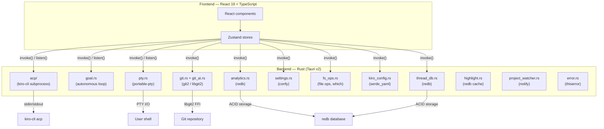
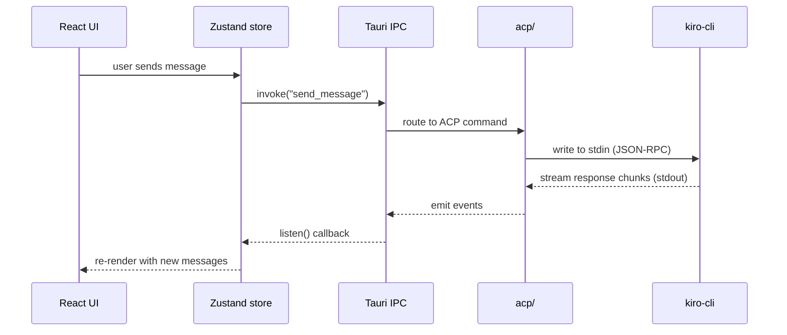

# Architecture

## System overview

Kirodex is a native desktop app for managing AI coding agents via the Agent Client Protocol (ACP). The app is built with Tauri v2: a Rust backend handles subprocess management, git operations, file system access, terminal emulation, analytics, and config persistence, while a React 19 frontend provides the UI. All communication between the two layers happens through Tauri's IPC (`invoke()` for commands, `listen()` for events). There are no Node.js APIs in the frontend.

## Data flow

A typical user interaction follows this path: the React UI dispatches an action to a Zustand store, which calls a Tauri `invoke()` command. The Rust backend processes the command and, for streaming operations like ACP chat, emits events back to the frontend via `listen()` callbacks that update the store.

## Backend modules

All Rust modules live in `src-tauri/src/commands/`. Tauri commands return `Result<T, AppError>` (except `acp/`, which uses `Result<T, String>` due to `!Send` constraints).

### Core modules

| Module | Purpose |
|--------|---------|
| `acp/` | ACP protocol implementation. Spawns `kiro-cli acp` as a subprocess and implements the ACP `Client` trait. Each connection runs on a dedicated OS thread with a single-threaded tokio runtime. |
| `goal.rs` | Autonomous goal loop orchestrator. Manages plan → implement → verify cycles with self-correction (Ralph Loop pattern). |
| `git.rs` | Git operations via `git2` (libgit2 bindings). Branch, stage, commit, push, pull, fetch, worktree management. |
| `git_ai.rs` | AI-powered commit message generation from diff analysis. |
| `git_history.rs` | Git log and history traversal. |
| `git_pr.rs` | Pull request creation and management. |
| `git_stack.rs` | Stacked branch workflows. |
| `git_utils.rs` | Shared git utility functions. |
| `pty.rs` | Terminal emulation via `portable-pty`. Manages PTY child process lifecycle. |
| `settings.rs` | Config persistence via `confy`. |
| `fs_ops.rs` | File operations and kiro-cli binary detection via the `which` crate. |
| `kiro_config.rs` | `.kiro/` project configuration discovery and parsing. |
| `error.rs` | Shared `AppError` enum via `thiserror`. |

### Data and persistence

| Module | Purpose |
|--------|---------|
| `analytics.rs` | Local analytics with ACID-compliant `redb` storage. Tracks coding hours, messages, tokens, tool calls, diff stats, model usage. |
| `thread_db.rs` | Thread and conversation persistence via `redb`. |
| `highlight.rs` | Syntax highlighting with `redb`-backed cache for performance. |
| `checkpoint.rs` | Conversation checkpoint management for btw/tangent mode. |

### AI and processing

| Module | Purpose |
|--------|---------|
| `branch_ai.rs` | AI-powered branch name generation. |
| `thread_title.rs` | AI-powered thread title generation from conversation content. |
| `pr_ai.rs` | AI-powered PR description generation. |
| `pattern_extract.rs` | Pattern extraction from agent responses (corrections, progress). |
| `streaming_diff.rs` | Real-time diff parsing from streaming agent output. |
| `diff_parse.rs` | Unified diff parsing and rendering. |
| `diff_stats.rs` | Diff statistics computation. |
| `markdown.rs` | Markdown processing and rendering support. |

### Infrastructure

| Module | Purpose |
|--------|---------|
| `project_watcher.rs` | Real-time filesystem watching for the file tree panel. |
| `kiro_watcher.rs` | Watches `.kiro/` directory for config changes. |
| `vcs_status.rs` | Git status indicators per file (modified, added, deleted, renamed). |
| `fuzzy.rs` | Fuzzy search implementation for command palette and pickers. |
| `transport.rs` | ACP transport layer abstraction. |
| `tracing.rs` | Application-level tracing and debug logging. |
| `process_diagnostics.rs` | Process health monitoring and diagnostics. |
| `retry.rs` | Retry logic with exponential backoff. |
| `serde_utils.rs` | Shared serialization utilities. |

## Frontend architecture

### Stores

Zustand stores in `src/renderer/stores/` are the single source of truth. No Redux, no React Context for global state.

| Store | Responsibility |
|-------|---------------|
| `taskStore.ts` | Tasks, messages, streaming state, ACP connection lifecycle, split view |
| `settingsStore.ts` | Agent profiles, model selection, appearance preferences |
| `kiroStore.ts` | `.kiro/` config state (agents, skills, steering, MCP servers) |
| `diffStore.ts` | Diff viewer file selection and content |
| `debugStore.ts` | Debug panel log entries and filters |
| `updateStore.ts` | App update checking and installation state |
| `jsDebugStore.ts` | JS console capture for debug panel |
| `fileTreeStore.ts` | File tree panel state, expansion, and filesystem data |
| `filePreviewStore.ts` | File preview modal state |
| `analyticsStore.ts` | Analytics dashboard data and chart state |
| `goalStore.ts` | Goal mode state (objective, iterations, budget, corrections) |
| `vcsStatusStore.ts` | Per-file git status indicators |

### Components

Components live in `src/renderer/components/`, organized by feature:

| Directory | Contents |
|-----------|----------|
| `ui/` | Radix UI primitives styled with `class-variance-authority`, composed via `cn()` helper |
| `chat/` | ChatPanel, MessageList, ChatInput, SplitChatLayout, slash command panels |
| `sidebar/` | TaskSidebar, KiroConfigPanel, ThreadItem, ProjectItem |
| `code/` | CodePanel, DiffViewer (Shiki for syntax highlighting) |
| `analytics/` | Analytics dashboard with nine chart types (Recharts) |
| `file-tree/` | FileTreePanel, TreeContextMenu |
| `settings/` | SettingsPanel with multiple tabs |
| `diff/` | DiffPanel |
| `debug/` | DebugPanel |
| `dashboard/` | Dashboard, TaskCard |
| `task/` | NewProjectSheet |
| `unified-title-bar/` | Cross-platform title bar |
| `icons/` | Custom icon components |

### Key standalone components

- `CommandPalette.tsx` — `Cmd+K` quick navigation with frecency ranking
- `CommitDialog.tsx` — Git commit with AI message generation
- `Onboarding.tsx` — First-run setup wizard
- `ErrorBoundary.tsx` — React error boundary with recovery
- `PublishRepoDialog.tsx` — Repository publishing workflow
- `CloneRepoDialog.tsx` — Repository cloning
- `WhatsNewDialog.tsx` — Release notes display
- `UpdateAvailableDialog.tsx` — App update prompt

### Hooks

- `useSlashAction` — Client-side slash command handler. Returns `{ handled: boolean }` so the caller knows whether to forward the command to ACP.
- `useKeyboardShortcuts` — Global keyboard shortcut registration
- `useAttachments` — File and image attachment handling

### IPC layer

`src/renderer/lib/ipc.ts` wraps Tauri's `invoke()` and `listen()` APIs. All frontend-to-backend communication goes through this module. Event listeners from `listen()` must return their unlisten function in `useEffect` cleanup to prevent memory leaks and duplicate handlers.

### Path aliases

`@/*` maps to `./src/renderer/*`, configured in both `tsconfig.json` and `vite.config.ts`.

## Concurrency model

### The !Send ACP pattern

The `agent-client-protocol` crate produces futures that are `!Send`. These cannot run on tokio's default multi-threaded runtime. The solution:

1. Spawn a `std::thread` per ACP connection
2. Inside that thread, create a `tokio::runtime::Builder::new_current_thread()` runtime
3. Use `tokio::task::LocalSet::block_on()` to run the `!Send` futures
4. The Tauri async runtime sends commands to the connection thread via `mpsc::unbounded_channel`
5. The connection thread emits events back to the frontend via Tauri's event system

This pattern isolates each ACP connection on its own OS thread while keeping the Tauri async runtime free for other commands.

### mpsc channels

Each ACP connection has an `mpsc::UnboundedSender` that the Tauri command handlers use to send `AcpCommand` variants (send message, cancel task, kill connection, etc.) to the connection thread. The connection thread's event loop receives these commands and dispatches them to the ACP client.

### Permission oneshot channels

When the ACP agent requests a permission (file write, command execution, etc.), the connection thread creates a `oneshot::channel` and stores the sender in the managed `AcpState`. The frontend displays a permission dialog; when the user responds, the Tauri command (`task_allow_permission` / `task_deny_permission`) looks up the sender in `AcpState` via `app.try_state::<AcpState>()` and sends the response. The connection thread receives it on the `oneshot::Receiver` and forwards the decision to the ACP client.

### Window cleanup

Tauri's `on_window_event` with `CloseRequested` drains all ACP connections (sending `AcpCommand::Kill` to each) and clears PTY state. An ack-based flush protocol ensures frontend state is persisted before shutdown: Rust emits `app://flush-before-quit`, the frontend flushes and emits `app://flush-ack`, Rust waits with a two-second timeout.

## State management patterns

### Zustand selector discipline

Always use selectors (`useStore(s => s.field)`) instead of `useStore()` to prevent full-store re-renders. For multiple fields, use `shallow` equality. For derived state, use `useMemo` over computing in render.

### Bail-out guards

Every setter checks if the value changed before calling `set()`. Without this, every ACP event triggers a React re-render even when nothing changed. Multi-field updates use a single `setState` callback instead of multiple `getState()` + `set()` calls to avoid stale reads.

### rAF batching for high-frequency events

Debug log entries and streaming chunks arrive at hundreds per second. These are buffered and flushed once per `requestAnimationFrame` using `concat + slice` instead of per-entry array copies.

### Streaming isolation

A `StreamingMessageList` child component owns the four streaming selectors (`streamingChunk`, `liveToolCalls`, `liveThinking`, `messages`), isolating re-renders from the rest of the chat UI during streaming.

### localStorage safety

`localStorage.getItem()` and `setItem()` throw in private browsing, incognito, or quota-exceeded contexts. Store initialization wraps these in try-catch with fallback values. Setters use try-catch with `console.warn` so in-memory state still updates even if persistence fails.

### Persistence

State-changing actions that modify persisted data must call `persistHistory()` after `set()`. The persistence layer uses `tauri-plugin-store` with a self-write detection mechanism (`_selfWriteCount`) to prevent reload loops from `autoSave` triggering `onKeyChange`.

## Tech stack

| Layer | Technology |
|-------|-----------|
| Desktop framework | Tauri v2 |
| Backend | Rust 2021, agent-client-protocol, git2, thiserror, confy, serde_yaml, which, portable-pty, redb |
| Frontend | React 19, TypeScript 5, Vite 6 |
| Styling | Tailwind CSS 4 |
| State | Zustand 5 |
| UI primitives | Radix UI |
| Icons | Tabler icons (`@tabler/icons-react`) |
| Code highlighting | Shiki |
| Terminal | xterm.js + portable-pty |
| Virtualization | @tanstack/react-virtual |
| Diff | diff + @pierre/diffs |
| Markdown | react-markdown + remark-gfm |
| Charts | Recharts |
| Notifications | sonner (toasts), @tauri-apps/plugin-notification |
| Auto-update | @tauri-apps/plugin-updater |
| Package manager | bun |
| Testing | Vitest (frontend), Cargo test (backend) |

## Related documentation

- [Development guide](development.md) — Setup, workflow, and build commands
- [Getting started](getting-started.md) — User-facing guide for new users
- [IPC reference](ipc-reference.md) — Full command and event API
- [Keyboard shortcuts](keyboard-shortcuts.md) — Global shortcuts
- [Slash commands](slash-commands.md) — Chat command reference
- [Goal mode](goal-mode.md) — Autonomous agent loop
- [CONTRIBUTING.md](../CONTRIBUTING.md) — Code style, project layout, and PR process
